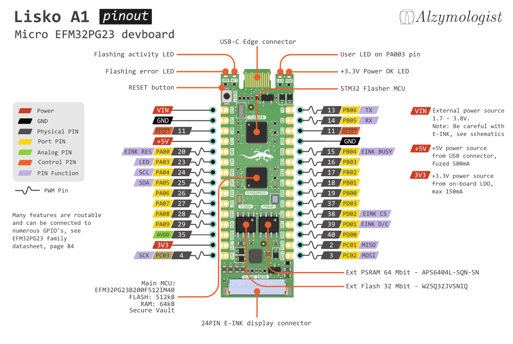

# Lisko


## Overview

Lisko is a EFM32PG23 devboard - micro version of the [Gecko PG23](https://www.silabs.com/development-tools/mcu/32-bit/efm32pg23-pro-kit?tab=overview) development board with NUCLEO-G431KB/Arduino-Nano-v3 pinout.

Lisko is breadboard and custom PCB ready, you can easily check your concept designs with EFM32 MCU

## Features

- EFM32PG23B200F512IM40 MCU with 512kB Flash, 64kB RAM, Secure Vault and almost all reroutable GPIOs
- onboard SWD Flasher based on STM32 with edge USB-C connector
- 32Mbit external Flash chip W25Q32JVSNIQ
- 64Mbit external PSRAM chip APS6404L-SQN-SN
- 24PIN E-INK connector with driver schematics, connected to EFM32PF23 MCU
- External MCU 1.7-3.8V power input for enegry-efficient devices 
- Build in 3.3V LDO with 150mA output pin to power the board from USB or external source VIN pin
- User LED on PA003 pin
- Reset button
- many LEDs for debugging - Power OK, flashing error, Flasher activity
- 30pin Arduino-Nano-v3/NUCLEO-G431KB pinout
- KiCad footprint to use it in your PCBs
- full OSHW, made with KiCad - the best ECAD

## Why did you create this?

We want to help people tinker with beautiful EFM32PG23 microcontroller more cheaply and handily.

## Why EFM32PG23?

This SiLabs MCU has many handy features, we use it mostly because of its Secure Vault and low power consumption for small security devices like crypto wallets or e-locks.

All the chip specs and datasheets can be found on the [EFM32PG23 MCU page](https://www.silabs.com/mcu/32-bit-microcontrollers/efm32pg23-series-2)

## Why do you call it Lisko?

The original SiLabs EFM32 microcontroller line is called Gecko, Lisko is a Finnish word for Gecko, thats simple. 

## How to make Lisko on your own

You can produce Lisko PCBs on any PCB fab you work with, for example, JLCPCB, PCBWAY or OSHPARK, the output files are ready for these fabs.

Gerber files are available in [/production](production/) folder

PCB Specs for order:
- Layers: 4
- Board thickness: 0.8mm - if you make it a different thickness it will not fit inside the USB-C connector
- Surface treatment: ENIG - it's important, don't use HASL or any other surface, it will add thickness and destroy your USB-C cable
- PCB colour/mask: green
- Silkscreen colour: white

You can order PCBs with assembly at your Fab, the [files](production/) are production ready and machine-readable and tested with JLCPCB.

Or order the [parts](docs/) separately and assemble the board on your own.

CSV BOM and interactive HTML BOM are available in [/docs](docs/) folder

All the parts are available at Mouser, Digikey and LCSC (and JLCPCB PCB assembly with LCSC warehouse too)

- [Digikey shared basket](https://www.digikey.fi/short/m47mv8nd)
- [Mouser shared basket](https://www.mouser.fi/ProjectManager/ProjectDetail.aspx?AccessID=fcf13b51e8)

We tried to make BOM as small as possible for this amount of features.

## How to flash your Lisko board

First of all, you need to upload the flasher firmware:

0. Install STM32 DFU flashing software for example [stm32cubeprog](https://www.st.com/en/development-tools/stm32cubeprog.html)
	
	Or install alternative DFU software, for example dfu-util tool:
	
	On a Linux machine you can install it using:

	```
	sudo apt-get install dfu-util
	```
	
	for other systems, see http://dfu-util.sourceforge.net/

1. Hold RESET button and connect Lisko to your PC with a USB-C cable

2. STM32 flasher MCU will go to DFU mode and appear in your system as a DFU device. You can check its availability using:

	```
	dfu-util --list
	```
	You should see something like this:
	```
	dfu-util --list
	dfu-util 0.8

	Copyright 2005-2009 Weston Schmidt, Harald Welte and OpenMoko Inc.
	Copyright 2010-2014 Tormod Volden and Stefan Schmidt
	This program is Free Software and has ABSOLUTELY NO WARRANTY
	Please report bugs to dfu-util@lists.gnumonks.org

	Found DFU: [0483:df11] ver=2200, devnum=49, cfg=1, intf=0, alt=3, name="@Device Feature/0xFFFF0000/01*004 e", serial="315A35663432"
	```

3. Now you can flash the flasher by using:

	```
	dfu-util -a 0 --dfuse-address 0x08000000 -D pilkki_0.0.1.bin
	```

	from the folder, there pilkki_0.0.1.bin file was placed. By default, you can find it in [/flasher-firmware](flasher-firmware/) folder of this repository.

4. Perfect!

If you want to tinker with the flasher firmware, you can find the source code in [Pilkki repo](https://github.com/Kalapaja/pilkki/tree/main/firmware)

## How to program your Lisko board

Binary firmware can be uploaded to Lisko EFM32 MCU using [Pilkki software](https://github.com/Kalapaja/pilkki/tree/main/software)

You can find test projects here:

- In C - in folder [/test-firmware](test-firmware/)

- Or in Rust - [Kampela project](https://github.com/Kalapaja/kampela-firmware)

## How to use Lisko in your PCB project

You can use Lisko with your breadboard prototype, see the pinout diagram and schematics for details.

Or you can integrate Lisko in your PCB as a module with SMD soldering or soldering it with two 15-pin 2.54mm pitch headers.

You can find the KiCad library and 3d models in [/kicad-library](kicad-library/) folder.

An example of module usage can be found in [Kampela Soldering Kit](https://github.com/vasya-zh/kampela-soldering-kit) project.

## About the PCB:

Lisko A1 is made on a 4-layers 0.8mm PCB. 

4 layers make the layout clean and easy and can be produced at any factory with no problem.

Designs and documentation are available in:
- [/kicad](kicad/) - [KiCad](https://www.kicad.org/) design files
- [/docs](docs/) - PDF schematics, interactive HTML BOM, pinout spreadsheet and CSV BOM

0.8mm is used because of the edge USB-C connector used in Lisko to make it cheaper and easier to reproduce. If you can make a device with fewer components, why not do it? Edge USB-C connector inserts directly in a common USB-C cable and works as a USB 2.0 device.

USB Edge connector KiCad library available at [PCB Edge USB connector library](https://github.com/vasya-zh/PCB-Edge-USB-connector-KiCad-library)

## TODO
- Add flasher firmware source code to this repo
- Improve flasher software docs for all OS's and add builds/releases
- Add SWD debugger functions in firmware and Pilkki software/OpenOCD support
- Add the project to https://kitspace.org/

## Contributors

- [Vasilii Zhuravskii](https://github.com/vasya-zh) - Lisko devboard idea, schematics, board design, DFM, docs, tests

- [Yuri Ilin](https://www.youtube.com/@katsuk) - schematics source (Pilkki and Kampela), flasher firmware, EFM32 test firmware in C with E-INK and other features

This project was made at [Alzymologist Oy](https://github.com/alzymologist) as a part of [Kampela](https://kampe.la) project.